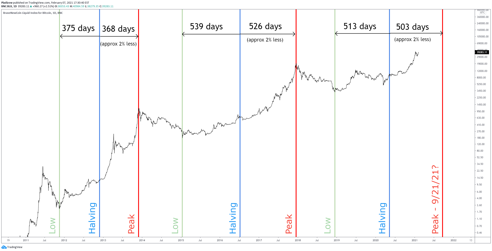
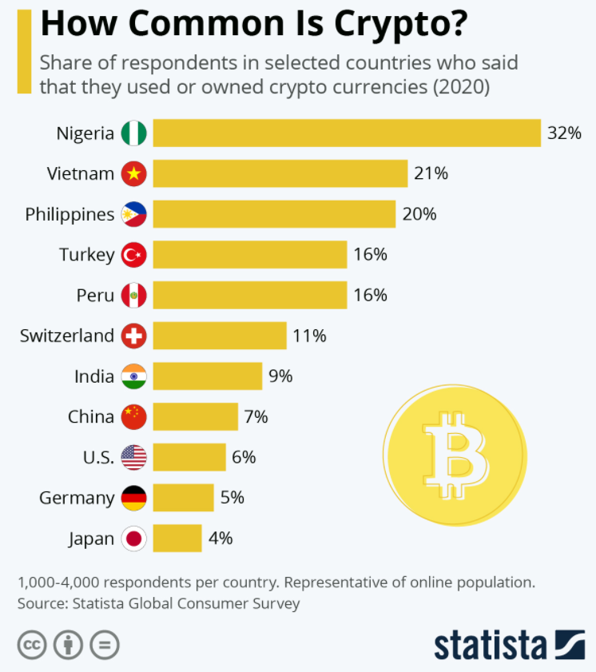
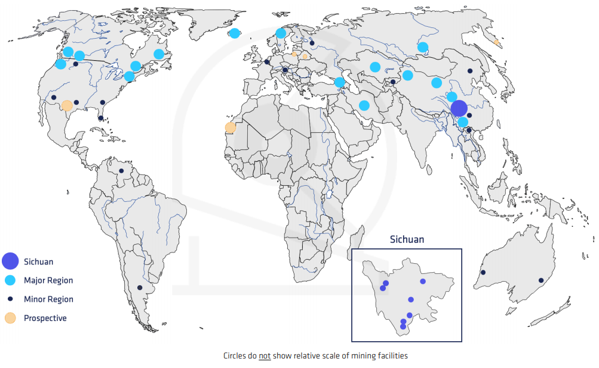

## Argumentos en contra de Bitcoin

### Volatilidad

_Bitcoin es volátil, no puedes usarlo como medio de intercambio._

Sí, el precio de bitcoin es volátil, y puede perder o ganar mucho valor en un solo día. Si deseas pagar algo en bitcoin, aún puedes hacerlo. Simplemente gasta la misma cantidad que has usado en moneda fiat, pero en bitcoin el mismo día. Sin volatilidad, no habrán pérdidas ni ganancias.

### Desarrollo de Precios  
_Bitcoin no sirve como reserva de valor debido a sus cambios de precio_

Puedes considerar a bitcoin como una inversión a largo plazo, ha sido la reserva de valor con mejor rendimiento de todas las clases de activos durante la última década.

 [^27]

Por supuesto, no hay garantía de que este rendimiento continúe para siempre.

En el momento de escribir este artículo, Bitcoin se encontraba en una carrera alcista, que comenzó en el último trimestre de 2020. Esto significa que el precio se apreció durante un período de semanas y meses con pequeños contratiempos intermedios. En mayo de 2021 se produjo una caída significativa, que muchos interpretaron como un retroceso saludable en un mercado sobrecalentado. El último período alcista comenzó en 2017 y terminó a principios de 2018. Desde entonces, el precio se ha "lateralizado" o movido relativamente hacia los lados, como se le llama en términos de los comerciantes (traders), lo que significa que no hay un gran movimiento alcista o bajista en el precio.

 [^28]

El desarrollo del precio de Bitcoin sigue fuertemente a los ciclos de "Halving". Aproximadamente cada 4 años, la cantidad de bitcoins acuñados por bloque, se reduce en un 50%. Esto significa que el crecimiento de bitcoins disponibles en el mercado se está reduciendo. Incluso si la demanda de bitcoin solo se mantiene en el mismo nivel, el precio aumentará.

### Escasez Digital  
El suministro total de bitcoins está limitado a 21 millones, 18,7 millones de los cuales ya están en el mercado. Cada cuatro años (o más exactamente, cada 210.000 bloques), la cantidad de bitcoins que se acuña se reduce a la mitad. Actualmente, el proceso de minería genera 6.25 bitcoins cada 10 minutos, que son 900 bitcoins por día y 328.500 por año. A partir de 2024, solo se acuñarán 450 bitcoins por día, ya que solo se emitirán 3,125 bitcoins por cada bloque generado. Esto significa que la cantidad disponible todos los días disminuye y la oferta se vuelve más escasa. Si el interés aumenta al mismo tiempo, el precio aumenta exponencialmente.

A partir de mayo de 2021, alrededor de 36 millones de USD (número de bitcoins acuñados diariamente * precio) deben ingresar al mercado de Bitcoin todos los días para mantener estable el precio actual de 40,000 USD. Siempre que el precio baja, se intercambian menos bitcoins de los que estaban disponibles ese día y viceversa.

Las fechas de estos "Halvings" se anotan en el cuadro siguiente. El precio sigue patrones similares antes y después de cada reducción a la mitad. En este gráfico, se predice que el tope de bitcoin será en septiembre de 2021, después de lo cual se espera que el precio caiga nuevamente, como puede ver en las líneas de cuadrícula marcadas como "Bajo". Por supuesto, esto es solo una predicción basada en algunos eventos y números históricos. No podemos tomar esto como un hecho dado en el futuro.

[^29]

Desde el lanzamiento de Bitcoin en 2009, ha habido varias caídas de precios. Debes estar preparado para que esto vuelva a suceder. La pregunta es qué tan bajo caerá porque en una escala logarítmica se puede ver que, con el tiempo, bitcoin solo ha ganado valor a largo plazo.

 [^30]

> No intentes burlar al mercado, no vendas. Solo conserva tus bitcoins. Al menos durante cinco años.

En el caso de un mercado bajista, cuando el precio de bitcoin inevitablemente baja, se perderá valor en términos de dinero fiduciario. Sin embargo, tu pila de bitcoins sigue siendo la misma. Si tienes 0.3 bitcoins en un mercado alcista, también tiene 0.3 bitcoins en un mercado bajista. Tus pérdidas están solo en tu percepción, dependiendo de la moneda o activo con el que compares tus bitcoins en un día determinado. Sé paciente, espera, no vendas: la historia indica que retener tus bitcoins a largo plazo es una forma segura de proteger tus valores.

> Solo coloca tanto dinero en bitcoins como estés dispuesto a perder. Si no puedes dormir en tiempos de depreciación, es posible que tenga demasiados activos de riesgo en forma de bitcoin.

### Sin Apelación
  
_Si envías tus bitcoins a la dirección incorrecta, se perderán. No podrás recuperarlos._

Verifica, verifica, verifica! varias veces la dirección antes de enviar tus bitcoins. No se puede revertir un pago. Al igual que con el dinero fiduciario, si compras algo en una tienda en línea y devuelve el producto, es responsabilidad comercial de la tienda manejar los bitcoins y devolvértelos. Sin embargo, una simple escritura incorrecta de una dirección debería resultar en un error de transacción en lugar de fondos perdidos, ya que las direcciones incluyen verificaciones de integridad.

### No Es Una Red Segura

_En las regiones desarrolladas del mundo, los depósitos en cuentas bancarias (en Europa hasta 100.000 euros) están asegurados. Este no es el caso de bitcoin._

Esto es correcto. Si tu tienes la custodia de tus bitcoins, entonces eres tu el único responsable. No hay seguro alguno. Pero ten en cuenta que, en caso de una gran crisis financiera, es posible que estos seguros fiduciarios no puedan devolverle el dinero de todos modos. Durante la crisis financiera de Chipre en 2013, se incautaron el 47,5% de todos los depósitos bancarios superiores a 100.000 euros. Si eres tu tu propio custodio, nadie puede confiscar tus bitcoin.

Si abrimos los ojos y pensamos en el resto del mundo, donde 2 mil millones de personas no están bancarizadas y el 80% de la población mundial vive en estados autoritarios, el caso de un dinero sin censura como bitcoin, donde tu mismo tienes el control y no un banco, todo tiene sentido lógico de nuevo. En esos países, donde las personas no tienen ninguna red de seguridad, la red Bitcoin puede brindar esa seguridad.

### No Puedo Permitirme Invertir
_No puedo comprar un bitcoin, es demasiado caro_

Está bien, no tienes que hacerlo. No hay un presupuesto mínimo necesario para usar bitcoin. Un bitcoin se puede dividir en unidades extremadamente pequeñas, mucho más pequeñas que un centavo. Puedes comprar una fracción de bitcoin y empezar a jugar con 20 dólares o incluso menos.

También puedes ganar bitcoins, pero hablaremos más sobre esto en el capítulo 9 "Ganar Bitcoin".

### Bitcoin Fracasará como las Primeras Empresas de Internet

_Bitcoin es una nueva tecnología. Es el primero de su tipo. Cuando comparamos esto con las primeras compañías de computadoras en la década de 1980 o las plataformas de Internet del boom de las punto com, casi ninguna sobrevivió. Bitcoin fue la primera cadena de bloques en el mercado y podría seguir la misma ruta._
    
Bitcoin ha sido la criptomoneda más utilizada en el mundo desde que se originó en 2009. Estoy de acuerdo, no hay garantías de que continuará de esa manera. El dominio del mercado de Bitcoin fue superior al 80% hasta 2017. Lo que significa que, de todas las miles de criptomonedas en el mercado, más del 80% de todas las inversiones se realizaron en Bitcoin. Esto cambió en 2017-18 cuando hubo una "guerra" entre diferentes ideas sobre cómo debería avanzar Bitcoin como tecnología. El debate del tamaño de bloque terminó con una bifurcación, donde la cadena de bloques de Bitcoin se dividió en dos bifurcaciones: Bitcoin (BTC) y Bitcoin Cash (BCH). En ese momento, otros proyectos de criptografía como Ethereum cobraron importancia. Cuatro años después, BCH ha disminuido constantemente a la insignificancia en comparación con BTC. Bitcoin mantuvo su dominio con más del 60% hasta la actual corrida alcista, donde cayó al 40% en el momento de escribir este artículo. Una corrida alcista da como resultado una atención más generalizada, lo que conlleva a la aparición de muchos artículos de medios desinformados y, cuando ciertos multimillonarios le agregan rumores y especulaciones a la candela, las Altcoins pasan al centro de la atención.

 [^31]

El resurgimiento del dominio de Bitcoin después del momento crítico de la bifurcación dura de 2017 fue una señal de la fortaleza para muchos expertos como la macroeconomista Lyn Alden y el inversionista estadounidense Michael Saylor, lo que los llevó a creer en el potencial futuro de Bitcoin como la criptomoneda ganadora que-se-lo-lleva-todo. E incluso si hubiera innovaciones tecnológicas en Altcoins que las impulsarían frente a Bitcoin, no hay duda de que los desarrolladores de Bitcoin también las implementarían.

### Bitcoin Fracasó

_Solo hay unos pocos usuarios de Bitcoin. Después de 12 años de existencia, muchas más personas deberían usar Bitcoin. Bitcoin ha fracasado._

Dado que el uso de Bitcoin, en principio, no está vinculado a identidades, no es estadísticamente posible saber cuántas personas realmente usan Bitcoin. Además, la cantidad de direcciones de Bitcoin no nos da idea de cuántas personas lo usan. Una persona puede tener millones de direcciones, o en el caso de bitcoin en casas de cambio centralizadas, miles de personas pueden ser administradas por una sola dirección de custodia grande.

Esas casas de cambio centralizadas deben verificar tu identidad antes de que se le permita cambiar el dinero fiduciario a bitcoin. La siguiente estadística muestra que más de 101 millones de personas en todo el mundo tienen una cuenta en dichas casas de cambio. Las personas que lograron obtener bitcoins en los primeros días u operar fuera de los límites de las casas de cambio centralizadas no se contabilizan.

 [^32]

Alrededor del 1.3% de la población mundial tenía una cuenta en una casa de cambios de criptomonedas a fines de 2020, un crecimiento de casi 190% entre 2018 y 2020. Aún así, se podría argumentar que esto no es mucho. Sin embargo, para una clase de activos y dinero completamente nuevos que se originó como un movimiento de base sin una empresa o marketing detrás de él, Bitcoin se ha desarrollado hasta el punto en que es ampliamente conocido, discutido y utilizado por más de 100 millones de personas en todo el mundo.

 [^33]

Este es el resultado de una encuesta en países seleccionados que muestra que el 32% de la población nigeriana ha utilizado o posee criptomonedas. Tengamos en cuenta que la población nigeriana tiene un promedio de 19 años, en comparación con la cifra de Estados Unidos de 38 y la edad promedio de Alemania de 44 años. Son jóvenes, quieren trabajar, conocen la tecnología y valoran las criptomonedas, a pesar de su volatilidad porque su propia moneda nacional, el Naira, está perdiendo el 25% de su valor cada año.

Si deseas saber más sobre Bitcoin en Nigeria, abre tu navegador y dirígete a: anita.link/88, anita.link/66 y anita.link/63

### Límite de Transacciones de Bitcoin
_La red Bitcoin solo es capaz de procesar siete transacciones por segundo. Eso no es suficiente para mantener una red de pagos a nivel global. Si todas las personas estuvieran usando Bitcoin, la red estaría sobrecargada._

La Red Lightning ha estado en desarrollo desde principios de 2018. Este es un protocolo que se encuentra un nivel por encima de la cadena de bloques de Bitcoin. Se espera que la Red Lightning maneje miles de micropagos por segundo en unos pocos años y ya ha mostrado un buen grado de éxito para pagos instantáneos entre continentes. La cadena de bloques de Bitcoin se utilizará como la capa de liquidación base para grandes transacciones, mientras que los pequeños pagos por un café, por ejemplo, se realizarán en la Red Lightning. Como usuario, tu no necesitas saber cómo funciona esto. La mayoría de nosotros no sabemos cómo funciona Netflix o enviar un correo electrónico y, sin embargo, lo hacemos todos los días.

### Concentración de Grupos de Minería  
Un grupo de minería es una estructura que "agrupa" los recursos computacionales proporcionados por hashers conectados (contribuyentes del grupo) para aumentar la probabilidad de encontrar un nuevo bloque, lo que da como resultado más pagos de recompensas en bitcoins.

Si bien es cierto que los grupos de minería pueden concentrarse en áreas o jurisdicciones específicas, como en China antes de que su gobierno autoritario prohibiera la minería de Bitcoin en junio de 2021, todavía tienen menos influencia de lo que podemos pensar en un principio. En primer lugar, los grupos de minería consisten en miles de mineros individuales. El hecho de que un grupo de minería esté ubicado en China no significa que el minero individual deba estar ubicado en China. Los Hashers quieren asegurarse de que el grupo al que contribuyen tenga un comportamiento alineado con la filosofía de Bitcoin. En caso de desacuerdo, los mineros pueden cambiar de grupo. En 2013, el grupo de minería de Bitcoin GHash.io alcanzó más del 50% del hashrate total de Bitcoin durante un breve período, lo que llevó a los hashers a apuntar proactivamente su poder de hash a otros grupos para evitar concentraciones potencialmente dañinas. El bajo costo de cambiar de grupo actúa como un sistema de control y equilibrio sobre el comportamiento autorregulador de los mineros. [^^C2-6]

 [^34]

El hard-fork que tuvo lugar en 2017 entre Bitcoin y Bitcoin Cash es un segundo ejemplo de cómo Bitcoin se autorregula. Los mineros y las grandes casas de cambio querían aumentar el tamaño de bloque de cada bloque de Bitcoin para lograr un mayor rendimiento de transacciones por bloque. La comunidad de operadores de nodos y usuarios de Bitcoin no querían cambiar el tamaño del bloque porque las personas con menor ancho de banda habrían estado en desventaja. En cambio, optaron por soluciones de segunda capa como la Red Lightning para abordar este problema. Esto resultó en la "guerra del tamaño del bloque", donde los mineros y las grandes empresas intentaron forzar los cambios en la red. Esto resultó en una bifurcación: Bitcoin se dividió en Bitcoin y Bitcoin Cash. Cuatro años después, Bitcoin Cash casi se olvida, mientras que Bitcoin es la criptomoneda más grande. Esto demostró que los mineros no tienen más poder que otros usuarios.

[^27]: [Fuente: Charlie Bilello](https://twitter.com/charliebilello/status/1370722188739891202/photo/1)  
[^28]: [Fuente: CoinGecko](https://www.coingecko.com/en/coins/bitcoin/usd), 7 de junio de 2021  
[^29]: [Fuente: Pladizow](https://twitter.com/Pladizow/status/1358545292782497792/photo/1)  
[^30]: [Fuente: CoinGecko](https://www.coingecko.com/en/coins/bitcoin/usd), 7 de junio de 2021  
[^31]: [Fuente: CoinMarketCap](https://coinmarketcap.com/charts/), 7 de junio de 2021  
[^32]: [Fuente: Cambridge Center for Alternative Finance, 3er estudio global de evaluación comparativa de criptoactivos, Fig. 34, Ilustración: Anita Posch](https://www.jbs.cam.ac.uk/faculty-research/centres/alternative-finance/publications/3rd-global-cryptoasset-benchmarking-study)  
[^33]: [Fuente: Statista](https://www.statista.com/chart/18345/crypto-currency-adoption/)  
[^34]: [Fuente: CoinShares, Bitcoin Mining, diciembre de 2019](https://coinshares.com/de/research/bitcoin-mining-network-december-2019)
